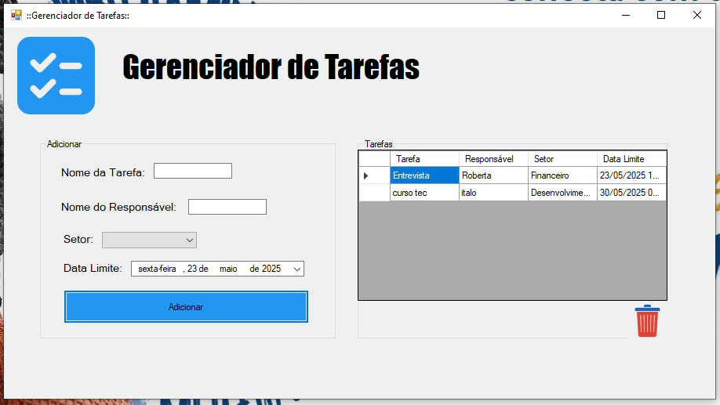

# Gerenciador de Tarefas

## Descrição
O **Gerenciador de Tarefas** é uma aplicação desktop desenvolvida em **C#** utilizando o framework **Windows Forms**. A aplicação permite criar, visualizar, editar e excluir tarefas, com uma interface amigável baseada em **DataGridView** para exibição das tarefas e **DateTime** para gerenciamento de datas. É ideal para organizar atividades pessoais ou profissionais com informações como título, descrição, data de criação e status.

## Funcionalidades
- **Adicionar Tarefa**: Insira novas tarefas com título, descrição, data de criação e status.
- **Visualizar Tarefas**: Exiba todas as tarefas em um **DataGridView** com colunas para título, descrição, data e status.
- **Editar Tarefa**: Modifique os detalhes de uma tarefa existente.
- **Excluir Tarefa**: Remova tarefas concluídas ou desnecessárias.
- **Gerenciamento de Datas**: Utilize o componente **DateTime** para registrar e filtrar tarefas por data.

## Tecnologias Utilizadas
- **Linguagem**: C#
- **Framework**: .NET (Windows Forms)
- **Componentes**: DataGridView, DateTimePicker
- **IDE Recomendada**: Visual Studio

## Como Usar
1. **Pré-requisitos**:
   - .NET Framework instalado.
   - Visual Studio ou outra IDE compatível com C#.
2. **Instalação**:
   - Clone o repositório: `git clone <URL_DO_REPOSITORIO>`
   - Abra o projeto no Visual Studio.
   - Compile e execute a solução.
3. **Funcionalidades da Interface**:
   - Use o formulário principal para adicionar tarefas preenchendo os campos de título, descrição e data.
   - Visualize as tarefas na **DataGridView**.
   - Clique com o botão direito em uma tarefa para editá-la ou excluí-la.

## Captura de Tela
Abaixo está uma captura de tela da interface principal do Gerenciador de Tarefas:



## Estrutura do Projeto
```
GerenciadorDtarefas/
├── GerenciadorDtarefas.sln
├── Form1.cs               # Código do formulário principal
├── Program.cs             # Ponto de entrada da aplicação
├── imagens/
│   └── print.png          # Captura de tela da interface
└── README.md
```

## Contribuição
1. Faça um fork do projeto.
2. Crie uma branch para sua feature: `git checkout -b minha-feature`.
3. Commit suas alterações: `git commit -m 'Adiciona minha feature'`.
4. Envie para o repositório remoto: `git push origin minha-feature`.
5. Abra um Pull Request.

## Licença
Este projeto está licenciado sob a [MIT License](LICENSE).

## Contato
Para sugestões ou dúvidas, entre em contato pelo email: exemplo@dominio.com.